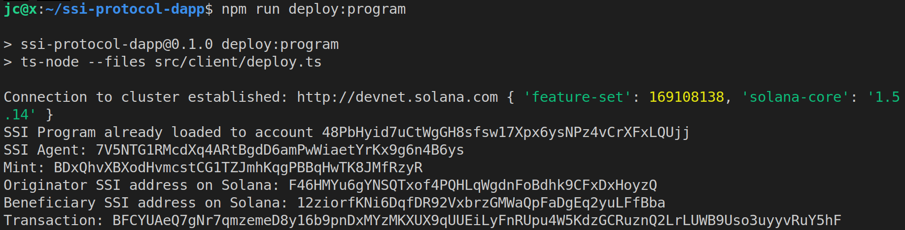

```own your data, empower your world```

Welcome to the open-source dapp for this [Self-Sovereign Identity (SSI) Protocol](https://www.ssiprotocol.com).

## xTransfer

The Self-Sovereign Identity can operate in Zilliqa and Solana, and xTransfers on the latter include a Travel Rule message.

Send $ZIL over an SSI Bridge and transfer it on Solana as a wrapped cryptocurrency named xZIL. Transfer this virtual asset along with the originator's personal information to Counter-Terrorism Financing (CTF) and Anti-Money Laundering (AML). This message powered on Solana is encrypted so that only the beneficiary can read it.

Virtual Asset Service Providers (VASPs) involved in an xTransfer comply with the data-sharing requirements stipulated by the Financial Action Task Force (FATF) Travel Rule while focusing on principle #7 of Privacy by Design: "Respect for user privacy — keep it user-centric".

xTransfer can be implemented for any token on Solana, Zilliqa and potentially others, making Tyron a multichain platform.

The SSI Protocol aims to integrate the following specifications:

- [Decentralized Identifiers (DIDs) v1.0](https://w3c.github.io/did-core/) by the World Wide Web Consortium (W3C). The tyronzil DID Method also registered in the [W3C DID Specification Registries](https://w3c.github.io/did-spec-registries/).

- [InterVASP Messaging Standard IVMS101](https://intervasp.org/wp-content/uploads/2020/05/IVMS101-interVASP-data-model-standard-issue-1-FINAL.pdf) by the Joint Working Group on interVASP Messaging Standards.

> [A related article by coindesk](https://www.coindesk.com/fatf-says-it-is-open-to-amending-crypto-travel-rule-guidance)

## Environment Setup

1. Install Rust from https://rustup.rs/
2. Install Solana v1.5.0 or later from https://docs.solana.com/cli/install-solana-cli-tools#use-solanas-install-tool
3. Install Node.js
4. Install NPM

## Quickstart

```bash
git clone https://github.com/pungtas/ssi-protocol-dapp.git

cd ssi-protocol-dapp
```

```bash
npm i --legacy-peer-deps
```

```bash
npm run build
```

### Build the program

```bash
cd program
```

```bash
cargo build
```

```bash
cargo build-bpf
```

### Deploy the SSI Protocol Program on Solana

```bash
npm run cluster:devnet
```

```bash
npm run solana
```

Deploy the SSI Protocol Program:

> Make sure that **"module": "commonjs"** in tsconfig.json

```bash
npm run deploy:program
```



The controller is the relayer, and controls the account submitting metatransactions to the Self-Sovereign Identity (also pays for the gas). The controller entity is part of the W3C DIDs specification, and in this SSI Protocol is also called Agent (similar to Hyperledger).

The originator and beneficiary got also initialized into the SSI Program. Users must provide a Solana address to their self-sovereign identities.

### Run the application

```bash
npm run start
```

## Testing
>
The SSI key pair is necessary for the [Self-Sovereign Identity smart contract](https://viewblock.io/zilliqa/address/zil1alcdyfq8e2un2unj9zh5hejq2ktu9enfmlmvkr?network=testnet&tab=code) to process the order after verifying the signature on-chain.

Private key:

```0937d53364ae36bf3343c97e4a449d1edb0ec84c88f3f1ea89a0a18c6779fc6a```

Public key:

```0x031aae1831994cd255c9ef7417eadf36d19494df23aeffe0e94164cb7e40d7f3cb```

## :zap:

This software is WIP. Built with the help of:
- [dapp-scaffold](https://github.com/solana-labs/dapp-scaffold)
- [messaging-backbone-v1](https://github.com/project-serum/messaging-backbone-v1)
- [didcomm-rs](https://github.com/decentralized-identity/didcomm-rs)

## Contributing

It'd be great to have your help! :zap:

> [Contributing guideline](./CONTRIBUTING.md)

> [Code of conduct](./CODE_OF_CONDUCT.md)

> [Open-source license](./LICENSE)
